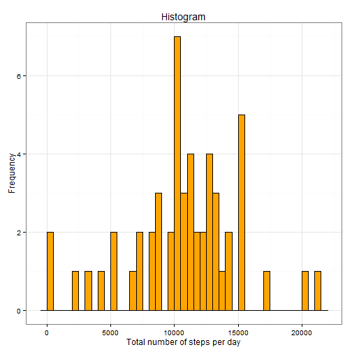
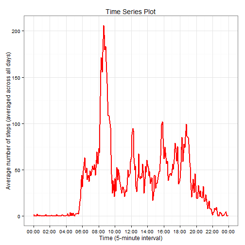
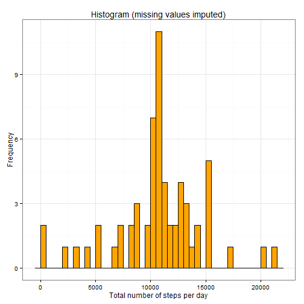
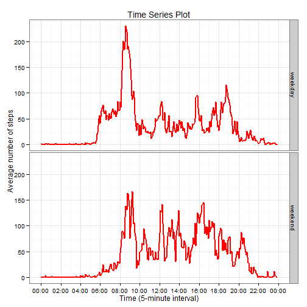

## Reproducible Research: Peer Assessment 1


### 1. Setting global options


```r
library(knitr)
opts_chunk$set(echo=TRUE)
```


### 2. Loading and preprocessing the data

```
Show any code that is needed to
1. Load the data (i.e. read.csv())
2. Process/transform the data (if necessary) into a format suitable for your 
   analysis.
```

#### Loading the data

Unzipping data into R working directory if the file does not exist already.

Then loading data into R.


```r
zipped <- file.path(getwd(), "activity.zip")
unzipped <- file.path(getwd(), "activity.csv")
if (!file.exists(unzipped)) { unzip(zipped) }

activity <- read.csv(file=unzipped,na.strings="NA",stringsAsFactors=FALSE)
```

#### Preprocessing the data

The `interval` column of the data is not continuous, jumping from 55 minutes to 100, meaning 1 hour and 00 minutes and not 100 minutes.

A new column `datetime` was created in the data set to store the correct date and time.


```r
hour <- activity$interval %/% 100
min <- activity$interval - hour * 100
datetime <- paste(activity$date, hour, min, sep=" ")

activity$datetime <- as.POSIXct(strptime(datetime,format="%Y-%m-%d %H %M"))
activity$date <- as.Date(activity$date,format="%Y-%m-%d")
```


### 3. What is mean total number of steps taken per day?

```
For this part of the assignment, you can ignore the missing values in the dataset.
1. Make a histogram of the total number of steps taken each day
2. Calculate and report the mean and median total number of steps taken per day
```

#### Histogram of the total number of steps taken each day

Histogram


```r
stepsDay <- aggregate(steps ~ date, data=activity, FUN=sum, na.action=na.omit)

library(ggplot2)
gHist <- ggplot(data=stepsDay, aes(x=stepsDay$steps)) +
        geom_histogram(colour="black",fill="orange",binwidth=500) +
        labs(title="Histogram") +
        xlab("Total number of steps per day") +
        ylab("Frequency") +
        theme_bw()
print(gHist)
```

 

#### Mean and Median total number of steps taken per day


```r
stepsDayMean <- format(mean(stepsDay$steps), scientific=FALSE)
stepsDayMedian <- format(median(stepsDay$steps), scientific=FALSE)
```

The mean total number of steps taken per day is 10766.19.

The median total number of steps taken per day is 10765.


### 4. What is the average daily activity pattern?

```
1. Make a time series plot (i.e. type = "l") of the 5-minute interval (x-axis) 
   and the average number of steps taken, averaged across all days (y-axis).
2. Which 5-minute interval, on average across all the days in the dataset, 
   contains the maximum number of steps?
```

To answer this question we need to extract the time from the "datetime" column and create a new "time" column (with present date). This "time" column will be similar to the original "interval" column of the data, but will be continuous and can be used for plotting purposes. As mentioned above the original "interval" column of the data is not continuous and should not be used directly.


```r
activity$time <- strftime(activity$datetime, format="%H:%M:%S")
activity$time <- as.POSIXct(activity$time, format="%H:%M:%S")
```

#### Time series plot


```r
stepsTime <- aggregate(steps ~ time, data=activity, FUN=mean, na.action=na.omit)

library(scales)
gTs <- ggplot(data=stepsTime, aes(x=time, y=steps)) +
        geom_line(colour="red",size=1.05) + 
        labs(title="Time Series Plot") +
        xlab("Time (5-minute interval)") +
        ylab("Average number of steps (averaged across all days)") +
        scale_x_datetime(labels=date_format("%H:%M"), breaks="2 hour") +
        theme_bw()
print(gTs)
```

 

#### Five-minute interval corresponding to maximum number of steps


```r
maxStepsIdx <- which.max(stepsTime$steps)
interval1 <- stepsTime[maxStepsIdx, "time"]
interval1 <- format(interval1, format="%H:%M")
interval2 <- stepsTime[maxStepsIdx+1, "time"]
interval2 <- format(interval2, format="%H:%M")
```

The 5-minute interval, on average across all the days in the dataset, that contains the maximum number of steps is the interval between 08:35 and 08:40.


### 5. Imputing missing values

```
Note that there are a number of days/intervals where there are missing values 
(coded as NA). The presence of missing days may introduce bias into some 
calculations or summaries of the data.
1. Calculate and report the total number of missing values in the dataset (i.e. 
   the total number of rows with NAs)
2. Devise a strategy for filling in all of the missing values in the dataset. 
   The strategy does not need to be sophisticated. For example, you could use 
   the mean/median for that day, or the mean for that 5-minute interval, etc.
3. Create a new dataset that is equal to the original dataset but with the 
   missing data filled in.
4. Make a histogram of the total number of steps taken each day and Calculate 
   and report the mean and median total number of steps taken per day. Do these
   values differ from the estimates from the first part of the assignment? What 
   is the impact of imputing missing data on the estimates of the total daily 
   number of steps?
```

#### Total number of missing values


```r
Nas <- sum(is.na(activity$steps))
```

The total number of missing values is 2304.

#### Filling in all of the missing values

Considering the objectives for this assessment, the strategy to input missing values was to replace them with the mean for the corresponding 5-minute interval.

#### New dataset

The new data set is then a copy of the original data, where missing values were replaced with the mean for the corresponding 5-minute interval.


```r
activityNew <- activity
activityNew$steps[is.na(activityNew$steps)] <- 
        round(tapply(activity$steps,activity$interval,FUN=mean,na.rm=TRUE),
              digits=0)
```

#### Histogram of the total number of steps taken each day

Histogram for the new data


```r
stepsDayNew <- aggregate(steps ~ date, data=activityNew, FUN=sum)

gHisNew <- ggplot(data=stepsDayNew, aes(x=stepsDayNew$steps)) + 
        geom_histogram(colour="black",fill="orange",binwidth=500) +
        labs(title="Histogram (missing values imputed)") +
        xlab("Total number of steps per day") +
        ylab("Frequency") +
        theme_bw()
print(gHisNew)
```

 

##### Mean and median total number of steps taken per day


```r
stepsDayMeanNew <- format(mean(stepsDayNew$steps), scientific=FALSE)
stepsDayMedianNew <- format(median(stepsDayNew$steps), scientific=FALSE)
```

The mean total number of steps taken per day is 10765.64.

The median total number of steps taken per day is 10762.

The Table below shows a comparison with the results from the original data:

|            | Original Data Set  | New Data Set          |
| :--------- |:------------------:| :--------------------:|
| **Mean**   | 10766.19   | 10765.64   |
| **Median** | 10765 | 10762 |


```
Do these values differ from the estimates from the first part of the assignment?
What is the impact of imputing missing data on the estimates of the total daily
number of steps?
```

They differ from the estimates from the first part of the assignment, but not significantly. In fact, the differences are very small.

This should be due to the fact that the missing values correspond to complete days where no information was provided. Those days (eight in total) were accross the two-months period, in October (8-Oct and 10-Oct) and in November (1-Nov, 4, 9, 10, 14 and 30-Nov).

The simplistic strategy used of filling in all of the missing values with the mean for the corresponding 5-minute interval, resulted in more 8 days going directly to the bar in the histogram that corresponds to the mean (from a frequency of 3 in the original data to a frequency of 11 in the new data). This does not affect significantly the values of the mean or the median.


### 6. Are there differences in activity patterns between weekdays and weekends?

```
For this part the weekdays() function may be of some help here. Use the dataset 
with the filled-in missing values for this part.
1. Create a new factor variable in the dataset with two levels - "weekday" and
   "weekend" indicating whether a given date is a weekday or weekend day.
2. Make a panel plot containing a time series plot (i.e. type = "l") of the 
   5-minute interval (x-axis) and the average number of steps taken, averaged 
   across all weekday days or weekend days (y-axis). See the README file in the
   GitHub repository to see an example of what this plot should look like using
   simulated data.
```

#### New factor variable with two levels - "weekday" and "weekend" 

A new factor variable is created in the new data set identifying the day type, i.e., "weekday" or "weekend".


```r
dayType <- function(x) {
        ifelse(weekdays(x) %in% c("Saturday", "Sunday"), "weekend", "weekday")
}

activityNew$dayType <- as.factor(sapply(activityNew$date, dayType))
```

#### Time series plot (panel)


```r
panelDat <- aggregate(steps ~ time + dayType, data=activityNew, FUN=mean)

gPanel <- ggplot(data=panelDat, aes(x=time, y=steps)) +
        geom_line(colour="red",size=1.05) + 
        facet_grid(dayType ~ .) +
        labs(title="Time Series Plot") +
        xlab("Time (5-minute interval)") +
        ylab("Average number of steps") +
        scale_x_datetime(labels=date_format("%H:%M"), breaks="2 hour") +
        theme_bw()
print(gPanel)
```

 

We can conclude that there are clear differences in activity patterns between weekdays and weekends.

During the week there is a significant spike in the average number of steps between 8:00h and 9:00h in the mormning. Then smaller peaks at lunch time and from 16:00h to around 19:00h.

During the weekend the activity starts and ends later and is in general higher throughout the day.


